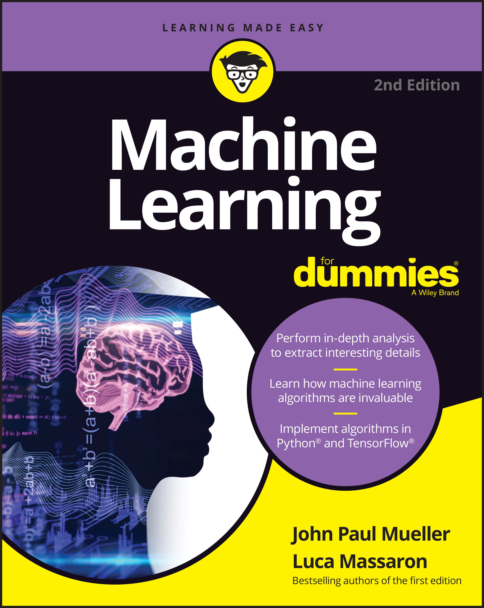

# Machine Learning For Dummies, 2nd ED
<B>Code and data repository for Machine Learning For Dummies 2nd edition</B>  

## From the Back Cover
Fun ways to work and play with new machine learning tools

What, exactly, is machine learning? How can you implement it, and which tools will you need? This book shows you how to build predictive models, detect anomalies, analyze text and images, and more. Machine learning makes all this possible. Dive into this exciting new technology with Machine Learning For Dummies, 2nd Edition. This even-friendlier new edition answers your questions ― guiding you in learning essential programming and concepts from scratch! Here is the entry-level info you need to get up and running with machine learning.

## Inside

* Intro to machine learning and AI
* Big data and algorithms explained
* Demystifying the math behind AI
* Many best practice examples
* Practical uses for machine learning
* Real-world datasets
* Ethical approaches to data use

## About the Authors

John Mueller has produced hundreds of books and articles on topics ranging from networking to home security and from database management to heads-down programming.

Luca Massaron is a senior expert in data science who has been involved with quantitative methods since 2000. He is a Google Developer Expert (GDE) in machine learning.

